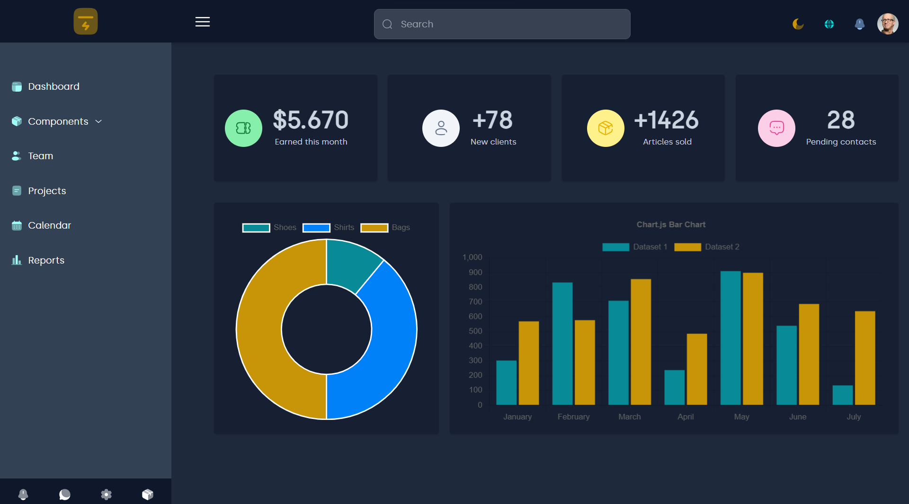
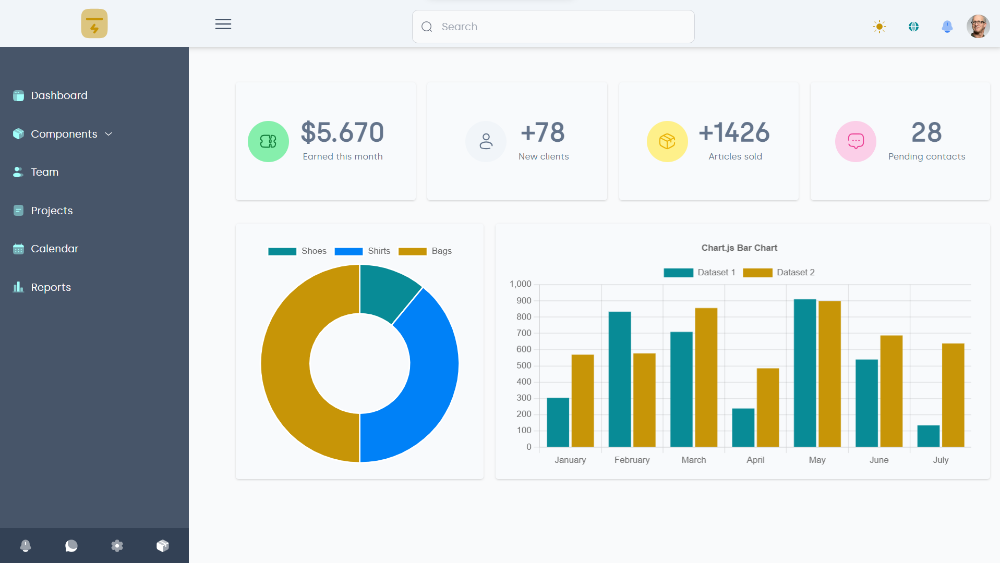

# React Vitesse  ⚛️ :

React starter template inspired by [vitesse](https://github.com/antfu/vitesse)

## Features : 

- ⚛️ ⚡️ [Reactjs](https://github.com/facebook/react), [Vite 2](https://github.com/vitejs/vite), [npm](https://npmjs.com/), [ESBuild](https://github.com/evanw/esbuild) ✅
- 🗂 [File based routing](./src/pages) ✅
- 🏪 [State Management via React Redux](https://react-redux.js.org/) ✅
- 🧱 [Layout system](./src/layouts) ✅
- 📲 [PWA](https://github.com/antfu/vite-plugin-pwa) ❌
- 🎨 [UnoCSS](https://github.com/antfu/unocss) - the instant on-demand atomic CSS engine ✅
- ⚓ [Use icons from any icon sets with classes](https://github.com/antfu/unocss/tree/main/packages/preset-icons) ✅
- [I18n ready](./src/locales) ✅
- 🖨 Static-site generation (SSG) via [vite-ssg](https://github.com/antfu/vite-ssg) ❌
- 🦾 TypeScript, of course ✅

  
 
 

## Installation : 

     git clone https://github.com/boussadjra/vitesse-react.git
     cd vitesse-react
     npm install
     npm run dev 

then visit http://localhost:3000/
